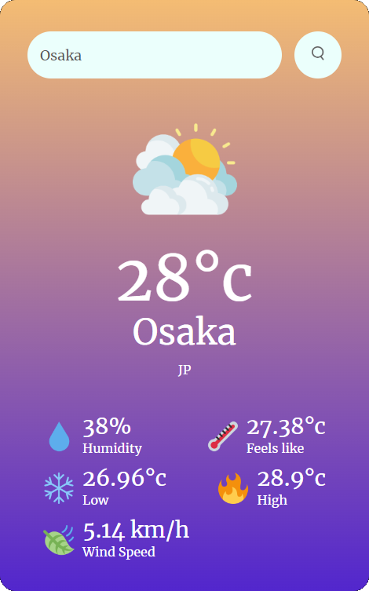

# Weather App

This is a weather app that shows temperature and other interesting stats for a provided city.

## Features
Some features and information my weather app provides are:
- Precipitation
- Temperature (°c)
- City
- Country
- Humidity
- Feels like
- Low temperature
- High temperature 
- Wind speed

## Running

### Pages
To run this project, open [this link](https://reaganvu29.github.io/Weather-App/) and enter any city in the search bar.

### Locally
To run the project locally, follow these steps:

1. Clone the repository to your local machine.
2. Navigate to the root directory of the project.
3. Open script.js with your preferred text editor.
4. Go to [https://openweathermap.org/](https://openweathermap.org/).
5. Create an account.
6. Click the API Key in the users dropdown.
7. Name and generate an API key. 
8. Activate your API key through your email.
9. Once active, substitute my API key with your own.
10. Open index.html and search whatever city you want.

## What I learned
I made this app with HTML, CSS, and JavaScript. I learned a lot about how each language operates and they come together. With CSS in particular, I learned that it had a lot more features than I expected with features like media queries. Media queries are a tool that allows you to conditionally style your page based on properties such as window width and device type. 

This was also my first experience integrating an API with my project. It was interesting learning a lot about how API keys works and how to utilize them effectively. Open weather map is an API that provides information about the weather across different time frames for areas all over the world. It definitely made me appreciate that fact that other developers make their data public and available.